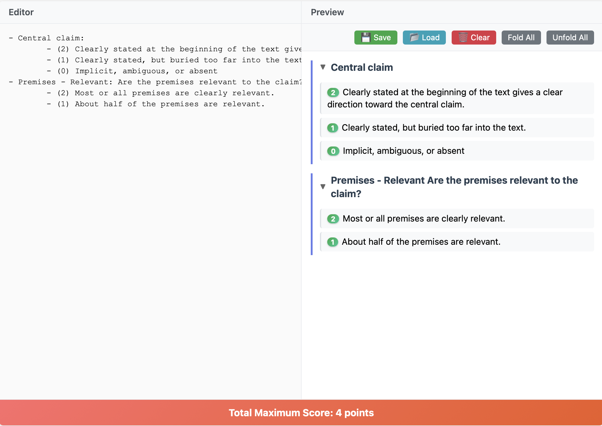
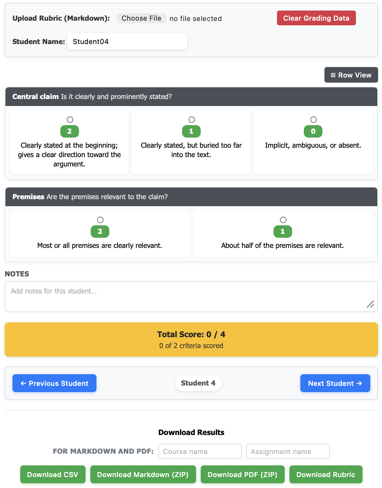

# Tools for desiging and applying grading rubric

Both tools run locally on your web browser.

## [`rubric_editor.html`](https://chatw.ch/grading_rubric_tools/rubric_editor.html){:target="_blank"} - Interactive rubric editor

## [`rubric_grader.html`](https://chatw.ch/grading_rubric_tools/rubric_grader.html){:target="_blank"} - Using rubric in grading

## Credits
Coded with contributions from Claude and local gpt-oss-20b.